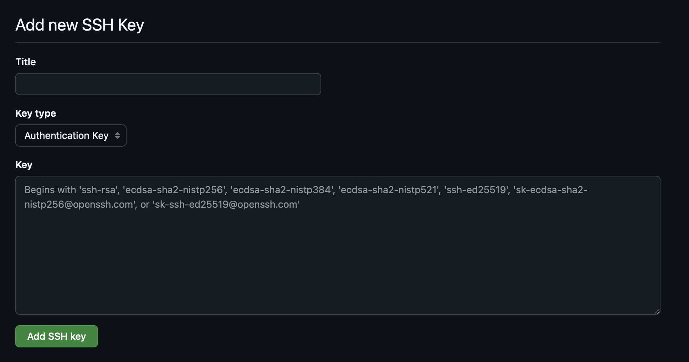

Mac 簡單配置不同 host 的 ssh-key

## 1. 生成新 SSH 金鑰

```bash
ssh-keygen -t ed25519 -C "your_email@example.com"
```

如果不命名，預設名是 `id_ed25519`，一路回車。

> 如果你用的是舊系統，可以使用 `rsa` 替代 `ed25519`。

這時候會自動建立 `.ssh` 資料夾。

## 2. 進入資料夾

```bash
cd ~/.ssh
```

## 3. 將新的 ssh-key 新增到 ssh-agent

```ssh
ssh-add ~/.ssh/id_ed25519
```

### 4. 儲存公鑰到託管服務，譬如 GitHub

```ssh
pbcopy < ~/.ssh/id_ed25519.pub
```

貼上到 Github 的這個位置：

頭像 -> Settings -> SSH and GPG keys -> New SSH key




### 5. 在不同的 host 中配置

```bash
vi config
```

點選鍵盤 `i` 鍵，鍵入以下資料

```ssh
# github
Host github.com
  HostName github.com
  PreferredAuthentications publickey
  IdentityFile ~/.ssh/id_ed25519
# bitbucket
Host bitbucket.org
  HostName bitbucket.org
  PreferredAuthentications publickey
  IdentityFile ~/.ssh/bitbucket_id_ed25519
```

按 `esc` 退出編輯模式，鍵入 `:wq` 儲存。

### 6. 測試一下

```ssh
ssh -T git@github.com
```

如果顯示下面的提示就是成功了，如果沒有可能就要看一下上面的步驟有沒有出錯

```ssh
Hi <user_name>! You've successfully authenticated, but GitHub does not provide shell access.
```

祝程式設計愉悅！

